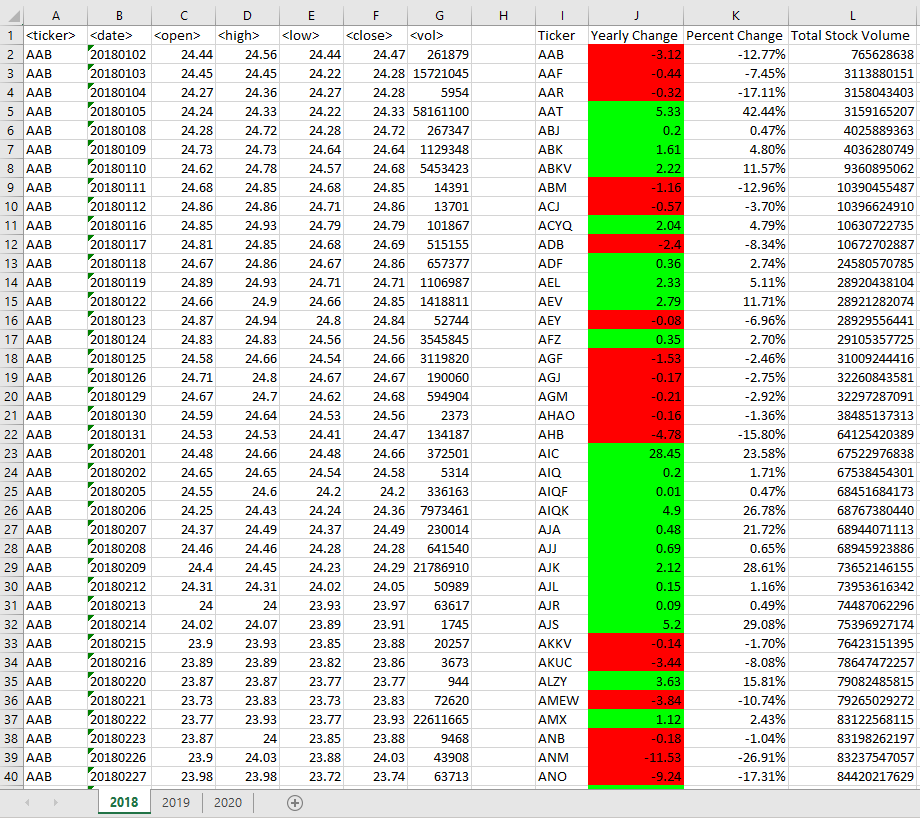
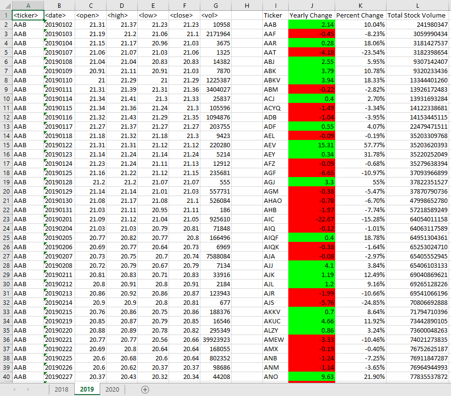
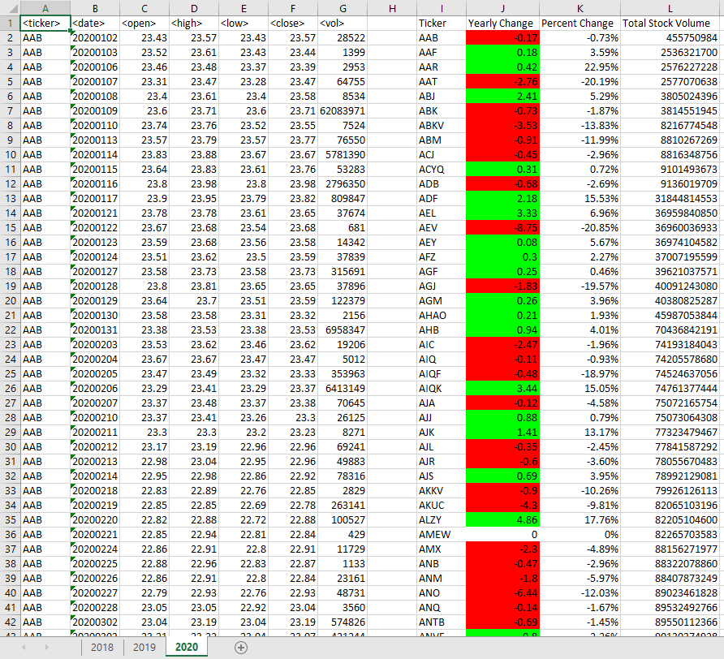

# VBA-Challenge
## Module 2 Challenge

## Summary
For this project I have created a VBA script that loops through stock for one year
and outputs:
- The ticker symbol
- The yearly change from the opening price and closing price
- The percentage change from the opening price and closing price
- The total stock volume of the stock 

Additionally I used VBA script to
- Highlight positive and negative change using conditional formatting

Below are screenshots of the years 2018-2020

### 2018 Stock Data

### 2019 Stock Data

### 2020 Stock Data

